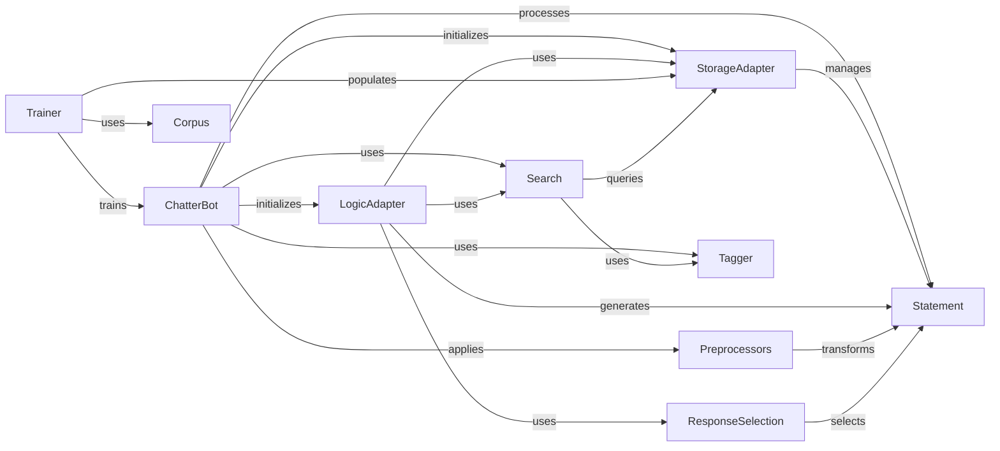

## Component Details

ChatterBot Subsystem: A detailed overview of its internal structure, operational flow, and pivotal role within the conversational AI system, including its relationships with other fundamental components.

### ChatterBot

The central orchestrator of the conversational AI. It initializes and integrates all other core components, manages the flow of interaction, processes user input, and coordinates the selection or generation of responses. It is the primary interface for interacting with the chatbot.

**Related Classes/Methods**:

- `ChatterBot` (0:0)

### StorageAdapter

This abstract base class serves as the blueprint for all data storage and retrieval operations within ChatterBot. It provides a standardized interface for managing conversational data (statements, responses, etc.), allowing different storage backends (e.g., SQL, NoSQL) to be plugged in seamlessly. Its methods are primarily designed to be overridden by concrete implementations.

**Related Classes/Methods**:

- <a href="https://github.com/gunthercox/ChatterBot/blob/master/chatterbot/storage/storage_adapter.py#L3-L178" target="_blank" rel="noopener noreferrer">`StorageAdapter` (3:178)</a>

### LogicAdapter

An abstract base class that defines the interface for all logic adapters. Logic adapters are responsible for processing input statements and generating appropriate responses based on various algorithms and rules. Concrete implementations provide specific conversational behaviors.

**Related Classes/Methods**:

- <a href="https://github.com/gunthercox/ChatterBot/blob/master/chatterbot/logic/logic_adapter.py#L9-L135" target="_blank" rel="noopener noreferrer">`LogicAdapter` (9:135)</a>

### Statement

A model class representing a conversational statement, fundamental for storing and retrieving conversational data within ChatterBot. Each `Statement` object encapsulates the text of a statement, its associated responses, and other metadata.

**Related Classes/Methods**:

- `Statement` (0:0)

### Preprocessors

A collection of functions that modify or clean input statements before they are processed by the chatbot's logic adapters. This can include tasks like converting text to lowercase, removing punctuation, or stemming words.

**Related Classes/Methods**:

- <a href="https://github.com/gunthercox/ChatterBot/blob/master/chatterbot/preprocessors.py#L0-L0" target="_blank" rel="noopener noreferrer">`Preprocessors` (0:0)</a>

### Search

Provides mechanisms for searching and retrieving statements from the chatbot's knowledge base, often used by logic adapters to find matching input statements or potential responses.

**Related Classes/Methods**:

- <a href="https://github.com/gunthercox/ChatterBot/blob/master/chatterbot/search.py#L0-L0" target="_blank" rel="noopener noreferrer">`Search` (0:0)</a>

### Tagger

Responsible for linguistic processing, such as part-of-speech tagging and lemmatization, to create indexed representations of text for efficient searching and comparison.

**Related Classes/Methods**:

- `Tagger` (0:0)

### Trainer

Manages the training process of the chatbot, enabling it to learn from various data sources like conversational corpora or lists of statements. It populates the chatbot's knowledge base, typically by interacting with the `StorageAdapter`.

**Related Classes/Methods**:

- `Trainer` (0:0)

### ResponseSelection

A component responsible for selecting the most appropriate response from a list of candidate responses generated by logic adapters. It often employs various algorithms to score and rank responses.

**Related Classes/Methods**:

- <a href="https://github.com/gunthercox/ChatterBot/blob/master/chatterbot/response_selection.py#L0-L0" target="_blank" rel="noopener noreferrer">`ResponseSelection` (0:0)</a>

### Corpus

Manages the loading and processing of conversational corpora, which are structured datasets used to train the chatbot. It provides methods to access and iterate over training data.

**Related Classes/Methods**:

- <a href="https://github.com/gunthercox/ChatterBot/blob/master/chatterbot/corpus.py#L0-L0" target="_blank" rel="noopener noreferrer">`Corpus` (0:0)</a>

### [FAQ](https://github.com/CodeBoarding/GeneratedOnBoardings/tree/main?tab=readme-ov-file#faq)