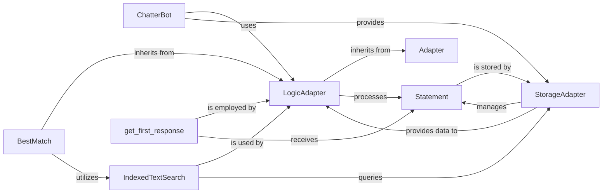

## Component Details

The LogicAdapter subsystem forms the "brain" of the ChatterBot, encapsulating the core conversational logic. It defines how the chatbot processes input statements, determines a suitable response, and assigns a confidence score to that response. This modular design allows for various conversational strategies to be implemented and selected based on the context.

### LogicAdapter

This is an abstract base class that defines the interface and core functionality for all logic adapters. It provides methods like `can_process` (to determine if an adapter can handle a given statement) and `process` (to generate a response). It also manages the selection of search algorithms and response selection methods.

**Related Classes/Methods**:

- <a href="https://github.com/gunthercox/ChatterBot/blob/master/chatterbot/logic/logic_adapter.py#L79-L86" target="_blank" rel="noopener noreferrer">`LogicAdapter:can_process` (79:86)</a>

- <a href="https://github.com/gunthercox/ChatterBot/blob/master/chatterbot/logic/logic_adapter.py#L88-L105" target="_blank" rel="noopener noreferrer">`LogicAdapter:process` (88:105)</a>

- `Adapter:__init__` (0:0)

### ChatterBot

The main chatbot instance that orchestrates the entire conversational flow. It initializes and utilizes various `LogicAdapter` instances to process user input, select the best response based on confidence scores, and interact with the storage layer.

**Related Classes/Methods**: _None_

### Statement

Represents a single conversational unit, such as a sentence or phrase. `Statement` objects are the primary data structure passed between the `ChatterBot`, `LogicAdapter` instances, and `StorageAdapter` for processing, searching, and storing conversational data.

**Related Classes/Methods**: _None_

### StorageAdapter

An abstract class defining the interface for interacting with the chatbot's underlying data store. Logic adapters rely on the `StorageAdapter` to retrieve past conversations, find matching statements, and store new ones. It provides methods for filtering, creating, updating, and retrieving statements.

**Related Classes/Methods**: _None_

### BestMatch

A concrete implementation of `LogicAdapter` that specializes in finding the best possible response by comparing the input statement to known statements in the database. It leverages a search algorithm to identify the closest match and then selects an appropriate response from associated statements.

**Related Classes/Methods**: _None_

### IndexedTextSearch

A search algorithm used by logic adapters (like `BestMatch`) to efficiently find statements in the database that are similar to a given input. It interacts with the `StorageAdapter` to retrieve potential matches and then uses a comparison function to determine confidence scores.

**Related Classes/Methods**: _None_

### get_first_response

A utility function that serves as a default response selection method. When a logic adapter has identified multiple potential responses, this method simply selects the first one from the list. It's a basic strategy that can be overridden by more sophisticated selection methods.

**Related Classes/Methods**: _None_

### Adapter

A base class from which other components, such as LogicAdapter, inherit, providing common initialization and utility.

**Related Classes/Methods**: _None_

### [FAQ](https://github.com/CodeBoarding/GeneratedOnBoardings/tree/main?tab=readme-ov-file#faq)