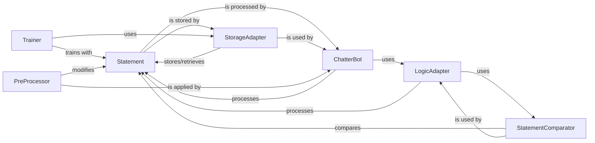

## Component Details

An overview of the `Statement` component within the `chatterbot` project, detailing its structure, purpose, and interactions with other core components.

### Statement

The Statement class serves as the fundamental data structure for representing a single unit of conversation within ChatterBot. It encapsulates the text of an utterance, along with crucial metadata such as its unique identifier (`id`), the conversation it belongs to (`conversation`), the persona who uttered it (`persona`), associated tags (`tags`), and a reference to the statement it is in response to (`in_response_to`). It also includes a `confidence` score (set when the statement is a bot's response) and a `created_at` timestamp. `Statement` objects are the primary means of data exchange and processing across all core components of ChatterBot, enabling the system to store, retrieve, process, respond to, and learn from conversational data.

**Related Classes/Methods**:

- `Statement` (1:1)

### ChatterBot

The main orchestrator of the chatbot. It manages the entire conversational flow, from receiving user input to selecting and generating responses. It utilizes various adapters and processors, all of which operate on `Statement` objects.

**Related Classes/Methods**:

- `ChatterBot` (1:1)

### StorageAdapter

An abstract base class defining the interface for storing and retrieving `Statement` objects. Concrete implementations (e.g., `SQLStorageAdapter`, `MongoDatabaseAdapter`) handle the actual database interactions. The `Statement.save()` method directly interacts with an instance of this adapter.

**Related Classes/Methods**:

- <a href="https://github.com/gunthercox/ChatterBot/blob/master/chatterbot/storage/storage_adapter.py#L3-L178" target="_blank" rel="noopener noreferrer">`StorageAdapter` (3:178)</a>

### LogicAdapter

An abstract base class for components that define the chatbot's response logic. Each `LogicAdapter` takes an input `Statement` and returns a response `Statement` (or a confidence score for a potential response).

**Related Classes/Methods**:

- <a href="https://github.com/gunthercox/ChatterBot/blob/master/chatterbot/logic/logic_adapter.py#L9-L135" target="_blank" rel="noopener noreferrer">`LogicAdapter` (9:135)</a>

### Trainer

An abstract base class for components responsible for training the chatbot. Trainers typically take lists of `Statement` objects (conversational data) and use them to populate the chatbot's knowledge base via the `StorageAdapter`.

**Related Classes/Methods**:

- `Trainer` (1:1)

### PreProcessor

An abstract base class for functions that modify an input `Statement` before it is processed by `LogicAdapter`s. Examples include converting text to lowercase or removing punctuation.

**Related Classes/Methods**:

- `PreProcessor` (1:1)

### StatementComparator

An abstract base class for functions that compare two `Statement` objects and return a numerical value indicating their similarity or confidence. These are crucial for `LogicAdapter`s to find the best match for an input.

**Related Classes/Methods**:

- `StatementComparator` (1:1)

### [FAQ](https://github.com/CodeBoarding/GeneratedOnBoardings/tree/main?tab=readme-ov-file#faq)