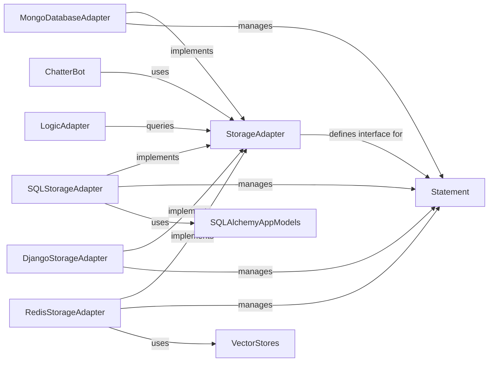

## Component Details

The `StorageAdapter` subsystem is fundamental to ChatterBot's ability to learn and maintain context by abstracting how conversational data is stored and retrieved. This design allows ChatterBot to be flexible with its backend database, supporting various storage solutions without altering the core logic.

### StorageAdapter

This is the abstract base class that defines the contract for all storage mechanisms within ChatterBot. It specifies the essential methods (e.g., `count`, `remove`, `filter`, `create`, `update`, `get_random`, `drop`) that any concrete storage adapter must implement to persist and retrieve `Statement` objects. Its purpose is to decouple the core chatbot logic from the underlying database technology.

**Related Classes/Methods**:

- <a href="https://github.com/gunthercox/ChatterBot/blob/master/chatterbot/storage/storage_adapter.py#L3-L178" target="_blank" rel="noopener noreferrer">`chatterbot.storage.storage_adapter.StorageAdapter` (3:178)</a>

- <a href="https://github.com/gunthercox/ChatterBot/blob/master/chatterbot/storage/storage_adapter.py#L56-L62" target="_blank" rel="noopener noreferrer">`chatterbot.storage.storage_adapter.StorageAdapter:count` (56:62)</a>

- <a href="https://github.com/gunthercox/ChatterBot/blob/master/chatterbot/storage/storage_adapter.py#L64-L72" target="_blank" rel="noopener noreferrer">`chatterbot.storage.storage_adapter.StorageAdapter:remove` (64:72)</a>

- <a href="https://github.com/gunthercox/ChatterBot/blob/master/chatterbot/storage/storage_adapter.py#L74-L123" target="_blank" rel="noopener noreferrer">`chatterbot.storage.storage_adapter.StorageAdapter:filter` (74:123)</a>

- <a href="https://github.com/gunthercox/ChatterBot/blob/master/chatterbot/storage/storage_adapter.py#L125-L132" target="_blank" rel="noopener noreferrer">`chatterbot.storage.storage_adapter.StorageAdapter:create` (125:132)</a>

- <a href="https://github.com/gunthercox/ChatterBot/blob/master/chatterbot/storage/storage_adapter.py#L142-L149" target="_blank" rel="noopener noreferrer">`chatterbot.storage.storage_adapter.StorageAdapter:update` (142:149)</a>

- <a href="https://github.com/gunthercox/ChatterBot/blob/master/chatterbot/storage/storage_adapter.py#L151-L157" target="_blank" rel="noopener noreferrer">`chatterbot.storage.storage_adapter.StorageAdapter:get_random` (151:157)</a>

- <a href="https://github.com/gunthercox/ChatterBot/blob/master/chatterbot/storage/storage_adapter.py#L159-L165" target="_blank" rel="noopener noreferrer">`chatterbot.storage.storage_adapter.StorageAdapter:drop` (159:165)</a>

### Statement

The core data model representing a single conversational utterance. A `Statement` object encapsulates the text of a user's input or the bot's response, along with metadata such as `in_response_to` (linking it to previous statements) and `tags`. It is the primary entity that `StorageAdapter` implementations are designed to store and retrieve.

**Related Classes/Methods**:

- <a href="https://github.com/gunthercox/ChatterBot/blob/master/chatterbot/conversation.py#L61-L117" target="_blank" rel="noopener noreferrer">`chatterbot.conversation.statement.Statement` (61:117)</a>

### MongoDatabaseAdapter

These are the specific implementations of the `StorageAdapter` interface, each tailored to interact with a particular database technology (MongoDB, SQL databases via SQLAlchemy, Django's ORM, and Redis, respectively). They translate the abstract storage operations into concrete database queries and commands.

**Related Classes/Methods**:

- <a href="https://github.com/gunthercox/ChatterBot/blob/master/chatterbot/storage/mongodb.py#L5-L249" target="_blank" rel="noopener noreferrer">`chatterbot.storage.mongodb.MongoDatabaseAdapter` (5:249)</a>

### SQLStorageAdapter

These are the specific implementations of the `StorageAdapter` interface, each tailored to interact with a particular database technology (MongoDB, SQL databases via SQLAlchemy, Django's ORM, and Redis, respectively). They translate the abstract storage operations into concrete database queries and commands.

**Related Classes/Methods**:

- <a href="https://github.com/gunthercox/ChatterBot/blob/master/chatterbot/storage/sql_storage.py#L4-L408" target="_blank" rel="noopener noreferrer">`chatterbot.storage.sql_storage.SQLStorageAdapter` (4:408)</a>

### DjangoStorageAdapter

These are the specific implementations of the `StorageAdapter` interface, each tailored to interact with a particular database technology (MongoDB, SQL databases via SQLAlchemy, Django's ORM, and Redis, respectively). They translate the abstract storage operations into concrete database queries and commands.

**Related Classes/Methods**:

- <a href="https://github.com/gunthercox/ChatterBot/blob/master/chatterbot/storage/django_storage.py#L4-L218" target="_blank" rel="noopener noreferrer">`chatterbot.storage.django_storage.DjangoStorageAdapter` (4:218)</a>

### RedisStorageAdapter

These are the specific implementations of the `StorageAdapter` interface, each tailored to interact with a particular database technology (MongoDB, SQL databases via SQLAlchemy, Django's ORM, and Redis, respectively). They translate the abstract storage operations into concrete database queries and commands.

**Related Classes/Methods**:

- <a href="https://github.com/gunthercox/ChatterBot/blob/master/chatterbot/storage/redis.py#L1-L1" target="_blank" rel="noopener noreferrer">`chatterbot.storage.redis.RedisStorageAdapter` (1:1)</a>

### ChatterBot

The main application class that orchestrates the entire chatbot's functionality. It initializes and utilizes a specific `StorageAdapter` instance to manage the bot's conversational data. It relies on the storage adapter to load existing knowledge, save new interactions, and retrieve statements for processing.

**Related Classes/Methods**:

- <a href="https://github.com/gunthercox/ChatterBot/blob/master/chatterbot/chatterbot.py#L1-L1" target="_blank" rel="noopener noreferrer">`chatterbot.chatterbot.ChatterBot` (1:1)</a>

### LogicAdapter

Components responsible for processing user input and generating appropriate responses. `LogicAdapter`s frequently query the `StorageAdapter` to retrieve relevant `Statement` objects from the bot's knowledge base, which are then used to determine the best possible response.

**Related Classes/Methods**:

- <a href="https://github.com/gunthercox/ChatterBot/blob/master/chatterbot/logic/logic_adapter.py#L9-L135" target="_blank" rel="noopener noreferrer">`chatterbot.logic.logic_adapter.LogicAdapter` (9:135)</a>

### SQLAlchemyAppModels

This module contains the SQLAlchemy ORM models (e.g., `Statement`, `Response`) that define the database schema for relational databases. These models are specifically used by the `SQLStorageAdapter` to map Python objects to database tables and facilitate data persistence.

**Related Classes/Methods**:

- <a href="https://github.com/gunthercox/ChatterBot/blob/master/chatterbot/ext/sqlalchemy_app/models.py#L1-L1" target="_blank" rel="noopener noreferrer">`chatterbot.ext.sqlalchemy_app.models` (1:1)</a>

### VectorStores

This module likely provides functionalities for storing and querying vector embeddings of text, which can be used for semantic search or similarity matching. The `RedisStorageAdapter` leverages this for advanced data retrieval, especially when dealing with large datasets or requiring efficient similarity-based lookups.

**Related Classes/Methods**:

- <a href="https://github.com/gunthercox/ChatterBot/blob/master/chatterbot/vectorstores.py#L1-L1" target="_blank" rel="noopener noreferrer">`chatterbot.vectorstores` (1:1)</a>

### [FAQ](https://github.com/CodeBoarding/GeneratedOnBoardings/tree/main?tab=readme-ov-file#faq)