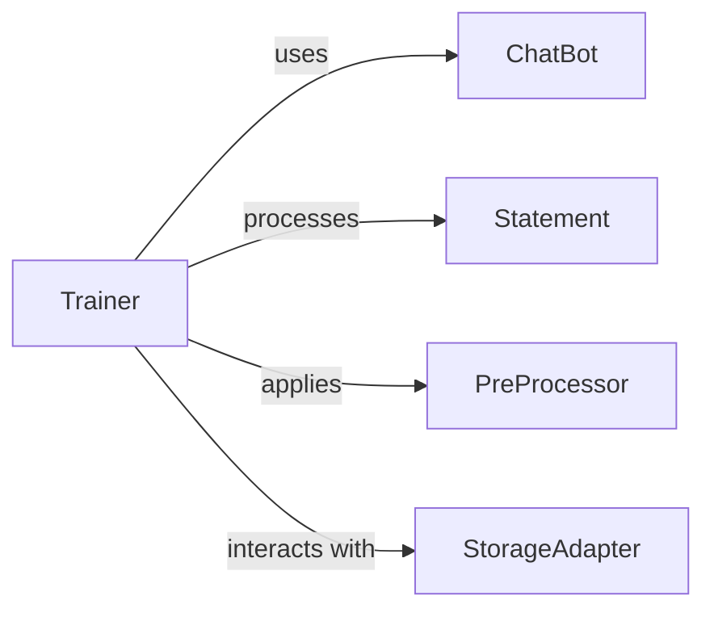

## Component Details

The `Trainer` subsystem in ChatterBot is responsible for managing the process of teaching the chatbot new conversational patterns. It provides a foundational structure for various training methods, allowing the chatbot to learn from diverse data sources.

### Trainer

This is the abstract base class for all training methods. It provides common functionalities such as initializing with a `ChatBot` instance, preprocessing input statements, and exporting conversational data for training. Its `train` method is abstract and must be implemented by concrete trainer classes.

**Related Classes/Methods**:

- <a href="https://github.com/gunthercox/ChatterBot/blob/master/chatterbot/trainers.py#L13-L76" target="_blank" rel="noopener noreferrer">`chatterbot.trainers.Trainer` (13:76)</a>

- <a href="https://github.com/gunthercox/ChatterBot/blob/master/chatterbot/trainers.py#L42-L46" target="_blank" rel="noopener noreferrer">`chatterbot.trainers.Trainer:train` (42:46)</a>

- <a href="https://github.com/gunthercox/ChatterBot/blob/master/chatterbot/chatterbot.py#L12-L360" target="_blank" rel="noopener noreferrer">`chatterbot.chatterbot.ChatBot` (12:360)</a>

- <a href="https://github.com/gunthercox/ChatterBot/blob/master/chatterbot/preprocessors.py#L0-L0" target="_blank" rel="noopener noreferrer">`chatterbot.preprocessors.PreProcessor` (0:0)</a>

- <a href="https://github.com/gunthercox/ChatterBot/blob/master/chatterbot/storage/storage_adapter.py#L3-L178" target="_blank" rel="noopener noreferrer">`chatterbot.storage.storage_adapter.StorageAdapter` (3:178)</a>

- <a href="https://github.com/gunthercox/ChatterBot/blob/master/chatterbot/conversation.py#L61-L117" target="_blank" rel="noopener noreferrer">`chatterbot.conversation.statement.Statement` (61:117)</a>

### ChatBot

The central instance of the chatbot. The `Trainer` interacts directly with the `ChatBot` to access its `StorageAdapter` (for data persistence) and `PreProcessor` instances (for input preparation).

**Related Classes/Methods**:

- <a href="https://github.com/gunthercox/ChatterBot/blob/master/chatterbot/chatterbot.py#L12-L360" target="_blank" rel="noopener noreferrer">`chatterbot.chatterbot.ChatBot` (12:360)</a>

### Statement

Represents a single unit of conversational data, typically an input or a response. The `Trainer` processes and manipulates `Statement` objects during preprocessing and data export.

**Related Classes/Methods**:

- <a href="https://github.com/gunthercox/ChatterBot/blob/master/chatterbot/conversation.py#L61-L117" target="_blank" rel="noopener noreferrer">`chatterbot.conversation.statement.Statement` (61:117)</a>

### PreProcessor

A callable object (or function) responsible for modifying or cleaning input statements before they are processed or stored. The `Trainer` applies these preprocessors to incoming statements.

**Related Classes/Methods**:

- <a href="https://github.com/gunthercox/ChatterBot/blob/master/chatterbot/preprocessors.py#L0-L0" target="_blank" rel="noopener noreferrer">`chatterbot.preprocessors.PreProcessor` (0:0)</a>

### StorageAdapter

Manages the persistence and retrieval of conversational data (statements) for the chatbot. The `Trainer` uses the `StorageAdapter` to access existing conversations for export.

**Related Classes/Methods**:

- <a href="https://github.com/gunthercox/ChatterBot/blob/master/chatterbot/storage/storage_adapter.py#L3-L178" target="_blank" rel="noopener noreferrer">`chatterbot.storage.storage_adapter.StorageAdapter` (3:178)</a>

### [FAQ](https://github.com/CodeBoarding/GeneratedOnBoardings/tree/main?tab=readme-ov-file#faq)