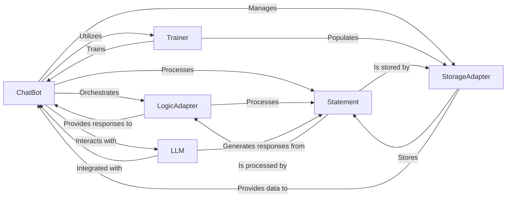

## Component Details

These six components are chosen as fundamental because they represent the essential functional blocks required for any conversational AI system like ChatterBot: ChatBot (entry point and central control unit), StorageAdapter (memory and persistence), LogicAdapter (the "brain" or intelligence), Trainer (learning mechanism), Statement (universal data structure), and LLM (generative capabilities).

### ChatBot

The central orchestrator of the conversational AI. It initializes and integrates all other core components, manages the flow of interaction, processes user input, and coordinates the selection or generation of responses. It is the primary interface for interacting with the chatbot.

**Related Classes/Methods**:

- <a href="https://github.com/gunthercox/ChatterBot/blob/master/chatterbot/chatterbot.py#L1-L1" target="_blank" rel="noopener noreferrer">`chatterbot.chatterbot` (1:1)</a>

### StorageAdapter

Defines the interface for persisting and retrieving conversational data, primarily `Statement` objects. It abstracts the underlying database technology, enabling the bot to store its learned knowledge and conversational history, which is crucial for maintaining context and improving over time.

**Related Classes/Methods**:

- <a href="https://github.com/gunthercox/ChatterBot/blob/master/chatterbot/storage/storage_adapter.py#L1-L1" target="_blank" rel="noopener noreferrer">`chatterbot.storage.storage_adapter` (1:1)</a>

### LogicAdapter

Implements specific strategies or algorithms for processing input statements and generating a suitable response. This component represents the "brain" of the chatbot, where the core conversational logic resides. Multiple logic adapters can be configured, allowing the `ChatBot` to select the best response based on confidence scores.

**Related Classes/Methods**:

- <a href="https://github.com/gunthercox/ChatterBot/blob/master/chatterbot/logic/logic_adapter.py#L1-L1" target="_blank" rel="noopener noreferrer">`chatterbot.logic.logic_adapter` (1:1)</a>

### Trainer

Provides methods to train the `ChatBot` instance by ingesting different types of conversational data. It populates the `StorageAdapter` with input-response pairs, enabling the bot to learn new conversational patterns and improve its responses over time.

**Related Classes/Methods**:

- <a href="https://github.com/gunthercox/ChatterBot/blob/master/chatterbot/trainers.py#L1-L1" target="_blank" rel="noopener noreferrer">`chatterbot.trainers.trainer` (1:1)</a>

### Statement

Represents a single unit of conversation, whether it's an input from the user or a response from the bot. It encapsulates the text, associated tags, confidence scores, and references to previous statements. `Statement` is the fundamental data structure exchanged and processed by all core components.

**Related Classes/Methods**:

- <a href="https://github.com/gunthercox/ChatterBot/blob/master/chatterbot/conversation.py#L1-L1" target="_blank" rel="noopener noreferrer">`chatterbot.conversation.statement` (1:1)</a>

### LLM

Provides an interface for integrating and interacting with Large Language Models (LLMs) like OpenAI or Ollama. This component allows the chatbot to leverage advanced generative AI capabilities for producing dynamic and contextually rich responses, acting as an alternative or supplement to traditional `LogicAdapter`s.

**Related Classes/Methods**:

- <a href="https://github.com/gunthercox/ChatterBot/blob/master/chatterbot/llm.py#L1-L1" target="_blank" rel="noopener noreferrer">`chatterbot.llm.llm` (1:1)</a>

### [FAQ](https://github.com/CodeBoarding/GeneratedOnBoardings/tree/main?tab=readme-ov-file#faq)