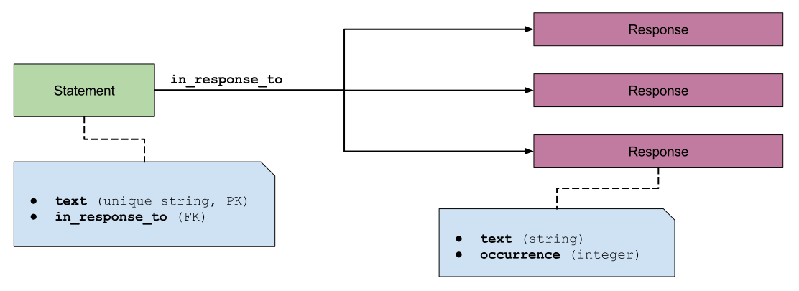
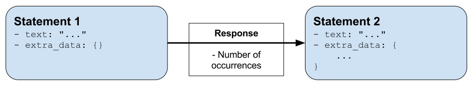

=============
Conversations
=============

ChatterBot supports the ability to have multiple concurrent conversations.
A conversations is where the chat bot interacts with a person, and supporting
multiple concurrent conversations means that the chat bot can have multiple
different conversations with different people at the same time.

Conversation scope
------------------

If two ``ChatBot`` instances are created, each will have conversations separate from each other.

An adapter can access any conversation as long as the unique identifier for the conversation is provided.

Conversation example
--------------------

The following example is taken from the Django ``ChatterBotApiView`` built into ChatterBot.
In this method, the unique identifiers for each chat session are being stored in Django's
session objects. This allows different users who interact with the bot through different
web browsers to have separate conversations with the chat bot.

.. literalinclude:: ../examples/django_app/example_app/views.py
   :language: python
   :pyobject: ChatterBotApiView.post
   :dedent: 4

..  _conversation_statements:

Statements
==========

ChatterBot's statement objects represent either an input statement that the
chat bot has received from a user, or an output statement that the chat bot
has returned based on some input.

.. autoclass:: chatterbot.conversation.Statement
   :members:

   .. autoinstanceattribute:: chatterbot.conversation.Statement.confidence

      ChatterBot's logic adapters assign a confidence score to the statement
      before it is returned. The confidence score indicates the degree of
      certainty with which the chat bot believes this is the correct response
      to the given input.

   .. autoinstanceattribute:: chatterbot.conversation.Statement.in_response_to

      The response attribute represents the relationship between two statements.
      This value of this field indicates that one statement was issued in response
      to another statement.

Statement-response relationship
===============================

ChatterBot stores knowledge of conversations as statements. Each statement can have any
number of possible responses.

Each ``Statement`` object has an ``in_response_to`` reference which links the
statement to a number of other statements that it has been learned to be in response to.
The ``in_response_to`` attribute is essentially a reference to all parent statements
of the current statement.

The count of recorded statements with matching, or similar text indicates the number of
times that the statement has been given as a response. This makes it possible for the
chat bot to determine if a particular response is more commonly used than another.
