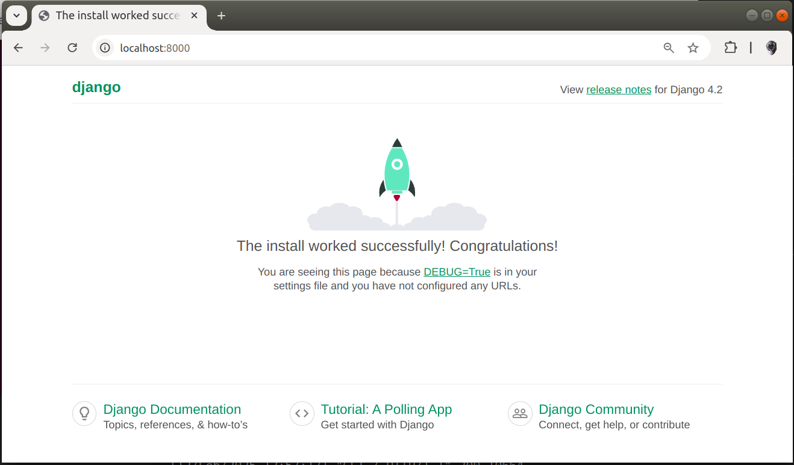

========================
Django Tutorial (Part 1)
========================

As mentioned in the previous section, this is a small tutorial designed to introduce basic parts of Django in a way that is simple and easy to understand. For a more comprehensive explanation, see the tutorial in Django's official documentation: https://docs.djangoproject.com/en/4.2/intro/tutorial01/

1. Install Django
=================

Begin by making sure that you have installed Django. For this tutorial we are going to be using the `latest stable version of Django`_, which is 4.2.

.. sourcecode:: sh

   pip install "django~=4.2"

2. Create a Django Project
==========================

Create a new Django project by running the following commands:

.. sourcecode:: sh

   django-admin startproject tutorial
   cd tutorial
   python manage.py startapp chapters

This will create a new directory called ``tutorial`` with the following structure:

.. code-block:: sh

   tutorial/
       manage.py
       tutorial/
           __init__.py
           settings.py
           urls.py
           wsgi.py
           asgi.py
       chapters/
           __init__.py
           migrations/
               __init__.py
           admin.py
           apps.py
           models.py
           tests.py
           views.py

These files are the basic structure of a Django project.

3. Run the Development Server
=============================

Now we've gone through enough of the setup that you should be able to start the development server by running the following command:

.. sourcecode:: sh

   python manage.py runserver 0.0.0.0:8000

You should see the following output:

.. code-block:: sh

   Watching for file changes with StatReloader
   Performing system checks...

   System check identified no issues (0 silenced).
   February 12, 2025 - 13:03:37
   Django version 4.2.19, using settings 'tutorial.settings'
   Starting development server at http://0.0.0.0:8000/
   Quit the server with CONTROL-C.

In your web browser, go to ``http://localhost:8000/``. You should see a "Welcome to Django" page.

4. Edit the Django Project settings
===================================

Open the file ``tutorial/settings.py`` in your text editor and add the ``chapters`` app to the ``INSTALLED_APPS`` list. When done it should look like this:

.. code-block:: python

   INSTALLED_APPS = [
      'django.contrib.admin',
      'django.contrib.auth',
      'django.contrib.contenttypes',
      'django.contrib.sessions',
      'django.contrib.messages',
      'django.contrib.staticfiles',

      'chapters',
   ]

5. Concluding Part 1
====================

This concludes part 1 of this mini Django tutorial. Now you know:

- The basics of installing a python package
- How to create a new Django project
- The basic structure of a Django project
- How to start the development server

In the next part of this tutorial, we will be covering concepts including views, models, and templates.

`Continue to Part 2`_.

.. _latest stable version of Django: https://www.djangoproject.com/download/
.. _Continue to Part 2: part-2.html
