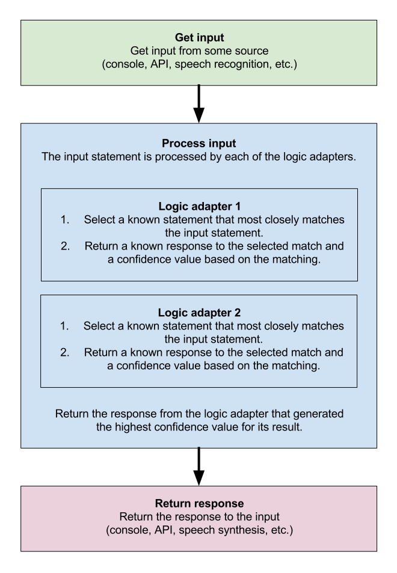

.. image:: ../graphics/banner.png

About ChatterBot
================

ChatterBot is a Python library that makes it easy to generate automated
responses to a user's input. ChatterBot uses a selection of machine learning
algorithms to produce different types of responses. This makes it easy for
developers to create chat bots and automate conversations with users.
For more details about the ideas and concepts behind ChatterBot see the
:ref:`process flow diagram <process_flow_diagram>`.

An example of typical input would be something like this:

.. code-block:: text

   user: Good morning! How are you doing?
   bot:  I am doing very well, thank you for asking.
   user: You're welcome.
   bot:  Do you like hats?

Language Independence
=====================

The language independent design of ChatterBot allows it to be trained to speak any language.
Additionally, the machine-learning nature of ChatterBot allows an agent instance to improve
it's own knowledge of possible responses as it interacts with humans and other sources of informative data.

How ChatterBot Works
====================

ChatterBot is a Python library designed to make it easy to create software that can engage in conversation.

An :term:`untrained instance` of ChatterBot starts off with no knowledge of how to communicate.
Each time a user enters a :term:`statement`, the library saves the text that they entered and the text
that the statement was in response to. As ChatterBot receives more input the number of responses
that it can reply and the accuracy of each response in relation to the input statement increase.

The program selects the closest matching :term:`response` by searching for the closest matching known
statement that matches the input, it then chooses a response from the selection of known responses
to that statement.

..  _process_flow_diagram:

Process flow diagram
====================

Contents:
=========

.. toctree::
   :maxdepth: 4

   setup
   quickstart
   tutorial
   examples
   training
   preprocessors
   logic/index
   storage/index
   filters
   chatterbot
   conversations
   comparisons
   utils
   corpus
   django/index
   faq
   commands
   development
   glossary

Report an Issue
===============

Please direct all bug reports and feature requests to the project's issue
tracker on `GitHub`_.

Indices and tables
==================

* :ref:`genindex`
* :ref:`modindex`
* :ref:`search`

.. _GitHub: https://github.com/gunthercox/ChatterBot/issues/
