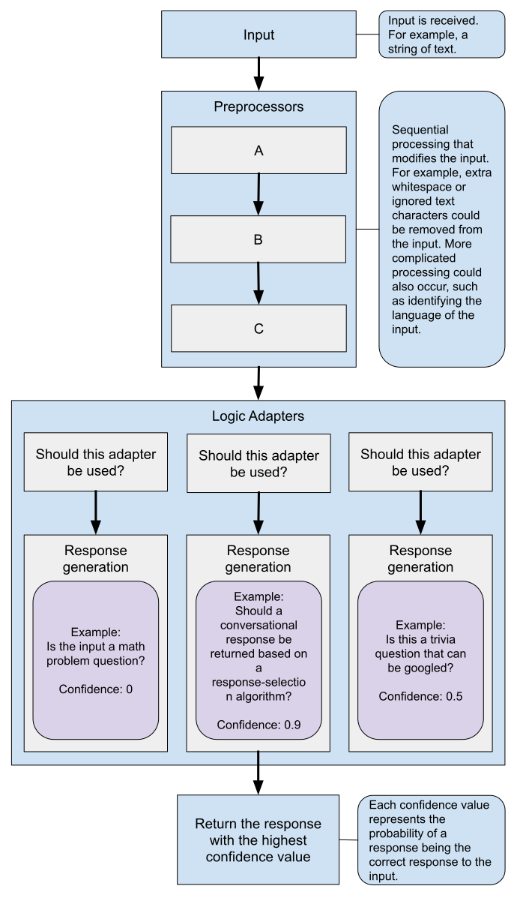

==============
Logic Adapters
==============

Logic adapters determine the logic for how ChatterBot selects a response to a given input statement.

.. toctree::
   :maxdepth: 1

   response_selection
   create-a-logic-adapter

The logic adapter that your bot uses can be specified by setting the ``logic_adapters`` parameter
to the import path of the logic adapter you want to use.

.. code-block:: python

   chatbot = ChatBot(
       "My ChatterBot",
       logic_adapters=[
           "chatterbot.logic.BestMatch"
       ]
   )

It is possible to enter any number of logic adapters for your bot to use.
If multiple adapters are used, then the bot will return the response with
the highest calculated confidence value. If multiple adapters return the
same confidence, then the adapter that is entered into the list first will
take priority.

Common logic adapter attributes
=================================

Each logic adapter inherits the following attributes and methods.

.. autoclass:: chatterbot.logic.LogicAdapter
   :members:

Best Match Adapter
==================

.. autofunction:: chatterbot.logic.BestMatch

The ``BestMatch`` logic adapter selects a response based on the best known match to a given statement.

How it works
------------

The best match adapter uses a function to compare the input statement to known statements.
Once it finds the closest match to the input statement, it uses another function to select one of the
known responses to that statement.

Setting parameters
------------------

.. code-block:: python

   chatbot = ChatBot(
       "My ChatterBot",
       logic_adapters=[
           {
               "import_path": "chatterbot.logic.BestMatch",
               "statement_comparison_function": chatterbot.comparisons.LevenshteinDistance,
               "response_selection_method": chatterbot.response_selection.get_first_response
           }
       ]
   )

.. note::

   The values for ``response_selection_method`` and ``statement_comparison_function`` can be a string
   of the path to the function, or a callable.

    See the :ref:`statement-comparison` documentation for the list of functions included with ChatterBot.

    See the :ref:`response-selection` documentation for the list of response selection methods included with ChatterBot.

Time Logic Adapter
==================

.. autofunction:: chatterbot.logic.TimeLogicAdapter

The ``TimeLogicAdapter`` identifies statements in which a question about the current time is asked.
If a matching question is detected, then a response containing the current time is returned.

.. code-block:: text

   User: What time is it?
   Bot: The current time is 4:45PM.

Mathematical Evaluation Adapter
===============================

.. autofunction:: chatterbot.logic.MathematicalEvaluation

The ``MathematicalEvaluation`` logic adapter checks a given statement to see if
it contains a mathematical expression that can be evaluated.
If one exists, then it returns a response containing the result.
This adapter is able to handle any combination of word and numeric operators.

.. code-block:: text

   User: What is four plus four?
   Bot: (4 + 4) = 8

Specific Response Adapter
=========================

If the input that the chat bot receives, matches the input text specified
for this adapter, the specified response will be returned.

.. autofunction:: chatterbot.logic.SpecificResponseAdapter

Specific response example
-------------------------

.. literalinclude:: ../../examples/specific_response_example.py
   :language: python

Low confidence response example
-------------------------------

.. literalinclude:: ../../examples/default_response_example.py
   :language: python
