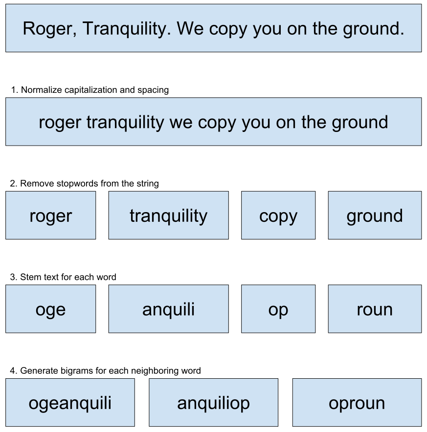

===========
Text Search
===========

ChatterBot's storage adapters support text search functionality.

Text Search Example
===================

.. literalinclude:: ../../tests/test_chatbot.py
   :language: python
   :pyobject: ChatterBotResponseTestCase.test_search_text_results_after_training

Bigram Text Index
=================

Bigram pairs are used for text search 

In addition, the generation of the pairs ensures that there is a smaller number
of possible matches based on the probability of finding two neighboring words
in an existing string that match the search parameter.

For searches in larger data sets, the bigrams also reduce the number of ``OR``
comparisons that need to occur on a database level. This will always be a
reduction of ``n - 1`` where ``n`` is the number of search words.

