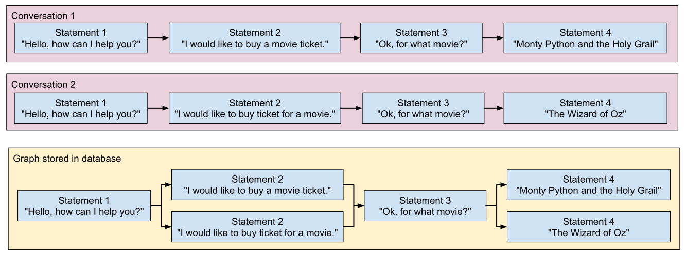

========
Training
========

ChatterBot includes tools that help simplify the process of training a chat bot instance.
ChatterBot's training process involves loading example dialog into the chat bot's database.
This either creates or builds upon the graph data structure that represents the sets of
known statements and responses. When a chat bot trainer is provided with a data set,
it creates the necessary entries in the chat bot's knowledge graph so that the statement
inputs and responses are correctly represented.

Several training classes come built-in with ChatterBot. These utilities range from allowing
you to update the chat bot's database knowledge graph based on a list of statements
representing a conversation, to tools that allow you to train your bot based on a corpus of
pre-loaded training data.

You can also create your own training class. This is recommended if you wish to train your bot
with data you have stored in a format that is not already supported by one of the pre-built
classes listed below.

Setting the training class
==========================

ChatterBot comes with training classes built in, or you can create your own
if needed. To use a training class you call `train()` on an instance that
has been initialized with your chat bot.

Training classes
================

Training via list data
----------------------

.. autofunction:: chatterbot.trainers.ListTrainer

For the training process, you will need to pass in a list of statements where the order of each statement is based
on its placement in a given conversation.

For example, if you were to run bot of the following training calls, then the resulting chatterbot would respond to
both statements of "Hi there!" and "Greetings!" by saying "Hello".

.. code-block:: python
   :caption: chatbot.py

    chatbot = ChatBot('Training Example')

.. code-block:: python
   :caption: train.py

   from chatbot import chatbot
   from chatterbot.trainers import ListTrainer
   
   trainer = ListTrainer(chatbot)

   trainer.train([
       "Hi there!",
       "Hello",
   ])

   trainer.train([
       "Greetings!",
       "Hello",
   ])

You can also provide longer lists of training conversations.
This will establish each item in the list as a possible response to it's predecessor in the list.

.. code-block:: python
   :caption: train.py

   trainer.train([
       "How are you?",
       "I am good.",
       "That is good to hear.",
       "Thank you",
       "You are welcome.",
   ])

Training with corpus data
-------------------------

.. autofunction:: chatterbot.trainers.ChatterBotCorpusTrainer

ChatterBot comes with a corpus data and utility module that makes it easy to
quickly train your bot to communicate. To do so, simply specify the corpus
data modules you want to use.

.. code-block:: python
   :caption: chatbot.py

    chatbot = ChatBot('Training Example')

.. code-block:: python
   :caption: train.py

   from chatbot import chatbot
   from chatterbot.trainers import ChatterBotCorpusTrainer

   trainer = ChatterBotCorpusTrainer(chatbot)

   trainer.train(
       "chatterbot.corpus.english"
   )

Specifying corpus scope
+++++++++++++++++++++++

It is also possible to import individual subsets of ChatterBot's corpus at once.
For example, if you only wish to train based on the english greetings and
conversations corpora then you would simply specify them.

.. code-block:: python
   :caption: train.py

   trainer.train(
       "chatterbot.corpus.english.greetings",
       "chatterbot.corpus.english.conversations"
   )

You can also specify file paths to corpus files or directories of corpus files when calling the ``train`` method.

.. code-block:: python
   :caption: train.py

   trainer.train(
       "./data/greetings_corpus/custom.corpus.json",
       "./data/my_corpus/"
   )

Training with the Ubuntu dialog corpus
--------------------------------------

.. warning::

   The Ubuntu dialog corpus is a massive data set. Developers will currently
   experience significantly decreased performance in the form of delayed
   training and response times from the chat bot when using this corpus.

.. autofunction:: chatterbot.trainers.UbuntuCorpusTrainer

This training class makes it possible to train your chat bot using the Ubuntu
dialog corpus. Because of the file size of the Ubuntu dialog corpus, the download
and training process may take a considerable amount of time.

This training class will handle the process of downloading the compressed corpus
file and extracting it. If the file has already been downloaded, it will not be
downloaded again. If the file is already extracted, it will not be extracted again.

Creating a new training class
=============================

You can create a new trainer to train your chat bot from your own
data files. You may choose to do this if you want to train your
chat bot from a data source in a format that is not directly supported
by ChatterBot.

Your custom trainer should inherit `chatterbot.trainers.Trainer` class.
Your trainer will need to have a method named `train`, that can take any
parameters you choose.

Take a look at the existing `trainer classes on GitHub`_ for examples.

.. _`trainer classes on GitHub`: https://github.com/gunthercox/ChatterBot/blob/master/chatterbot/trainers.py
