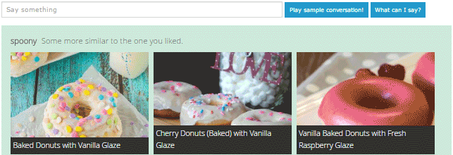

# chatbot
A simple chat bot in JavaScript with links to smart conversational APIs such as [WebKnox](https://webknox.com/api) (all purpose question answering), [spoonacular](https://spoonacular.com/food-api) (food related conversations), and [DuckDuckGo Instant Answers](https://duckduckgo.com/api) (mostly entities like movies, people, and places).

## Demo

Take a look at the JavaScript Chat Bot using the Duck Duck Go Engine: [DDG Demo](http://rawgit.com/ddsky/chatbot/master/demo/demo-ddg.html)

This Bot is more advanced using the WebKnox Engine (API key needed): [WebKnox Demo](http://rawgit.com/ddsky/chatbot/master/demo/demo-webknox.html)

Here a quick demonstration of the chatbot using the spoonacular conversation engine:


## Set up HTML
```html
<div id="chatBotCommandDescription"></div>
<input id="humanInput" type="text" />
<div id="chatBot">
    <div id="chatBotThinkingIndicator"></div>
    <div id="chatBotHistory"></div>
</div>
```

## Sample Usage

Initialize the bot. That is all you need to get a working chatbot.

```javascript
// initialize the bot
var config = {
    // what inputs should the bot listen to? this selector should point to at least one input field
    inputs: '#humanInput',
    // if you want to show the capabilities of the bot under the search input
    inputCapabilityListing: true,
    // optionally, you can specify which conversation engines the bot should use, e.g. webknox, spoonacular, or duckduckgo
    engines: [ChatBot.Engines.duckduckgo()],
    // you can specify what should happen to newly added messages
    addChatEntryCallback: function(entryDiv, text, origin) {
        entryDiv.slideDown();
    }
};
ChatBot.init(config);
```

Optionally, give your bot a name.
```javascript
ChatBot.setBotName("bender");
```

You can now also manually define some patterns that the bot should be able to react to.
```javascript
// 1. parameter: the pattern to listen for
// 2. parameter: either "response" to respond or "rewrite" to rewrite the request
// 3. parameter: either the response or the rewrite value, or undefined if nothing should happen
// 4. parameter: a callback function that gets the matches of the pattern
// 5. parameter: a description of that pattern, this is used to tell the user what he can say. Use quotes '' to mark phrases and [] to mark placeholders
ChatBot.addPattern(
    "(?:my name is|I'm|I am) (.*)",
    "response",
    "Hi $1, thanks for talking to me today", 
    function(matches){
        ChatBot.setHumanName(matches[1]);
    },
    "Say 'My name is [name]' to be called by your name."
);        

ChatBot.addPattern("^hi$","response","Howdy my friend", undefined, "Say 'Hi' to be greeted.");

ChatBot.addPattern(
    "compute ([0-9]+) plus ([0-9]+)", 
    "response", 
    undefined, 
    function (matches) {
        ChatBot.addChatEntry("That would be "+(1*matches[1]+1*matches[2])+".","bot");
    },
    "Say 'compute [number] plus [number]' to make the bot your math monkey"
);
```

How about you let your bot show its capabilities with a sample conversation?
```javascript
var sampleConversation = [
    "Hi",
    "My name is Botty McBotface",
    "Bye"
];

// play the conversation, second parameter is the pause between the inputs in milliseconds
ChatBot.playConversation(sampleConversation,4000)
```
    
You can also write your own answer engines, just implement the `react`, `getCapabilities`,  and `getSuggestUrl` methods. Here's a template:
```javascript
var myengine = function() {
    
    var capabilities = [
        "If you say 'hip hip', the bot says hooray"
    ]

    return {
        react: function (query) {
            
            var content = '';
            if (query == 'hip hip') {
                content = 'hooray';
            }
            
            ChatBot.addChatEntry(content, "bot");
            ChatBot.thinking(false);
  
        },
        getCapabilities: function() {
            return capabilities;
        },
        getSuggestUrl: function() {
            return 'https://yourserver/uniboxSuggests?query=';
        }
    }
}();
```
    
   
